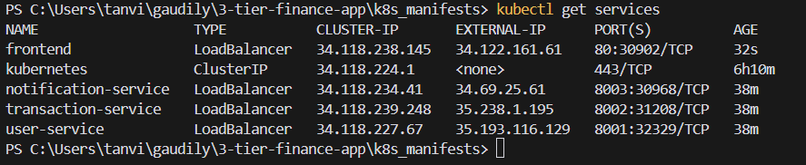
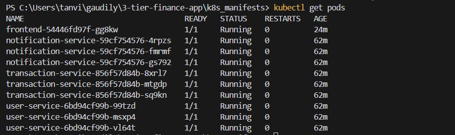
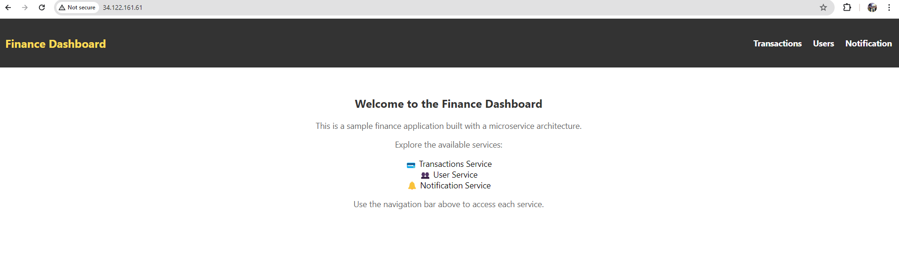

# 3-Tier Finance Applicatio## Overview

The 3-Tier Finance Application is a microservices-based application designed to provide a seamless experience for managing financial transactions. This sample app includes three primary services: User Service, Transaction Service, and Notification Service, along with a Frontend that allows users to interact with the backend services. This application is developed and deployed using Docker and Kubernetes, with Google Cloud Platform (GCP) as the cloud provider.

## Architecture

This application follows a 3-tier architecture:

1. **Frontend**: A React-based UI that interacts with backend services.
2. **Backend Services**:
   - **User Service**: Manages user authentication and profiles.
   - **Transaction Service**: Handles financial transactions and related operations.
   - **Notification Service**: Sends notifications (e.g., email, SMS) for transaction updates and alerts.
3. **Database**: SQLite is used for data persistence in this example.

## Technology Stack

- **Frontend**: React
- **Backend**: FastAPI
- **Containerization**: Docker
- **Orchestration**: Kubernetes
- **Cloud Provider**: Google Cloud Platform (GCP)
- **CI/CD**: GitHub Actions for automated Docker builds and Kubernetes deployments
- **Infrastructure as Code**: Terraform for creating GKE clusters and managing resources
- **Secrets Management**: Google Secrets Manager for secure configuration management

## CI/CD Pipeline

- **CI**: GitHub Actions automates Docker image building and pushes to Google Container Registry (GCR). It includes linting and testing workflows.
- **CD**: GitHub Actions deploys the services to Google Kubernetes Engine (GKE).
- **Infrastructure**: Terraform is used to create and manage GKE clusters and other necessary resources.

## Getting Started

### Prerequisites

Before you begin, ensure you have the following installed:

- [Docker](https://www.docker.com/get-started)
- [Kubernetes](https://kubernetes.io/docs/setup/)
- [kubectl](https://kubernetes.io/docs/tasks/tools/install-kubectl/)
- [Helm](https://helm.sh/docs/intro/install/) (for monitoring setup)
- [Terraform](https://www.terraform.io/downloads.html)

### Installation

1. **Clone the repository**:

   ```bash
   git clone https://github.com/cloudwithtanvir/3-tier-finance-app.git
   cd 3-tier-finance-app
   ```

2. **Build and deploy Docker images** for each service:

   ```bash
   cd user-service
   docker build -t gcr.io/YOUR_PROJECT_ID/user-service:latest .
   docker push gcr.io/YOUR_PROJECT_ID/user-service:latest

   cd ../transaction-service
   docker build -t gcr.io/YOUR_PROJECT_ID/transaction-service:latest .
   docker push gcr.io/YOUR_PROJECT_ID/transaction-service:latest

   cd ../notification-service
   docker build -t gcr.io/YOUR_PROJECT_ID/notification-service:latest .
   docker push gcr.io/YOUR_PROJECT_ID/notification-service:latest

   cd ../frontend
   docker build -t gcr.io/YOUR_PROJECT_ID/frontend:latest .
   docker push gcr.io/YOUR_PROJECT_ID/frontend:latest
   ```

3. **Deploy the application on Kubernetes**:

   ```bash
   kubectl apply -f k8s_manifests/
   ```

### Running Locally with Docker Compose

To run the application locally using Docker Compose, follow these steps:

1. **Create a `docker-compose.yml` file** in the root of your project with the following content:

   ```yaml
   version: '3.8'

   services:
     frontend:
       image: gcr.io/YOUR_PROJECT_ID/frontend:latest
       ports:
         - "3000:3000"
       depends_on:
         - user-service
         - transaction-service
         - notification-service

     user-service:
       image: gcr.io/YOUR_PROJECT_ID/user-service:latest
       ports:
         - "8001:80"
       environment:
         - ALLOWED_ORIGINS=http://localhost:3000

     transaction-service:
       image: gcr.io/YOUR_PROJECT_ID/transaction-service:latest
       ports:
         - "8002:80"

     notification-service:
       image: gcr.io/YOUR_PROJECT_ID/notification-service:latest
       ports:
         - "8003:80"
       environment:
         - ALLOWED_ORIGINS=http://localhost:3000
   ```

2. **Run the application** using Docker Compose:

   ```bash
   docker-compose up --build
   ```

3. **Access the application** by navigating to `http://localhost:3000` in your web browser.

### Kubernetes Deployment

#### Services and Pods Status

Here are screenshots showing the running services and pods:




#### Frontend Dashboard

The application's frontend dashboard can be accessed at the LoadBalancer IP for the frontend service. Here’s a preview of the dashboard:



## Monitoring with Prometheus and Grafana

To monitor the application, we use Prometheus and Grafana. These can be easily deployed using Helm.

### Step 1: Install Prometheus and Grafana Using Helm

1. **Add Helm Repositories**:

   ```bash
   helm repo add prometheus-community https://prometheus-community.github.io/helm-charts
   helm repo add grafana https://grafana.github.io/helm-charts
   helm repo update
   ```

2. **Create a Namespace for Monitoring**:

   ```bash
   kubectl create namespace monitoring
   ```

3. **Install Prometheus**:

   ```bash
   helm install prometheus-stack prometheus-community/kube-prometheus-stack --namespace monitoring
   ```

4. **Install Grafana**:

   ```bash
   helm install grafana grafana/grafana --namespace monitoring
   ```

### Step 2: Access Grafana Dashboard

1. **Get Grafana Admin Password**:

   ```bash
   kubectl get secret --namespace monitoring grafana -o jsonpath="{.data.admin-password}" | base64 --decode ; echo
   ```

2. **Retrieve External IPs for Prometheus and Grafana**:

   ```bash
   kubectl get svc -n monitoring
   ```

3. **Access Grafana** at `http://<GRAFANA_EXTERNAL_IP>:3000` and log in using the admin password obtained above.

4. **Configure Prometheus as a Data Source** in Grafana:

   - In Grafana, go to **Configuration > Data Sources**.
   - Add a new Prometheus data source with URL `http://prometheus-operated.monitoring.svc.cluster.local:9090`.

### Step 3: Explore Dashboards

Grafana comes with pre-configured dashboards for Kubernetes monitoring. You can start exploring metrics for CPU, memory usage, request rate, and other Kubernetes and application metrics.


## Acknowledgments

- [FastAPI](https://fastapi.tiangolo.com/) for the backend framework.
- [React](https://reactjs.org/) for the frontend framework.
- [Kubernetes](https://kubernetes.io/) for orchestration.
- [Docker](https://www.docker.com/) for containerization.